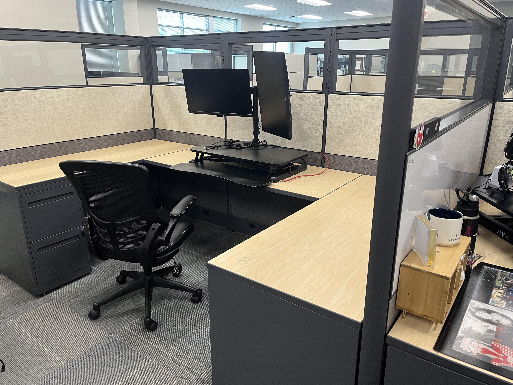
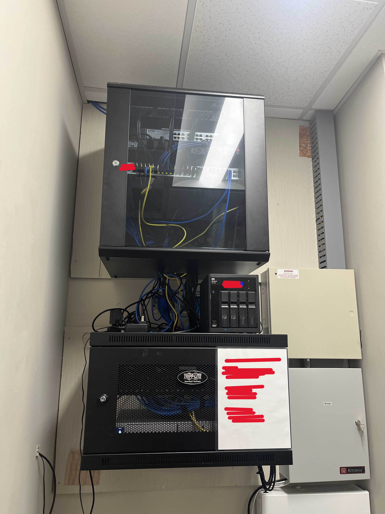
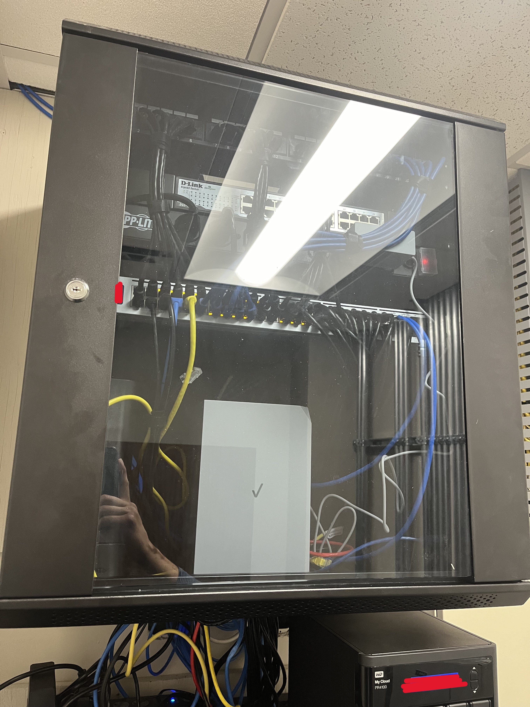
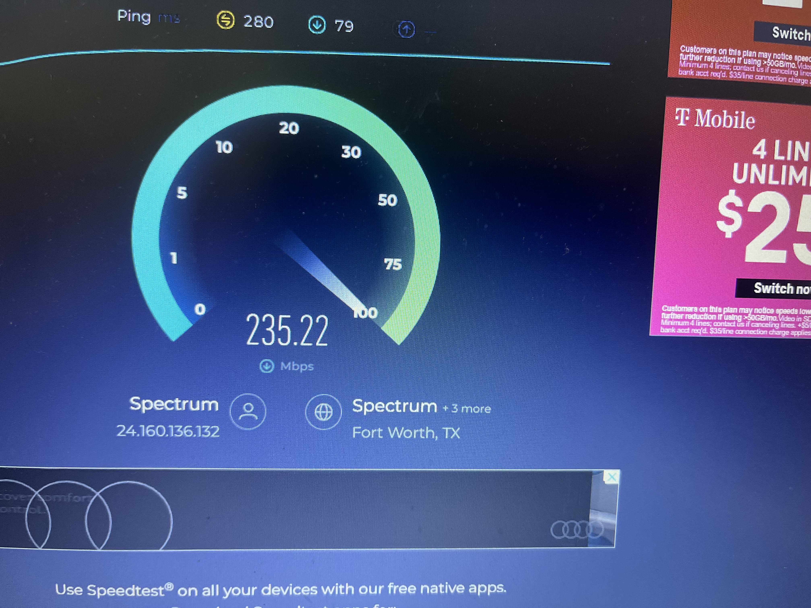
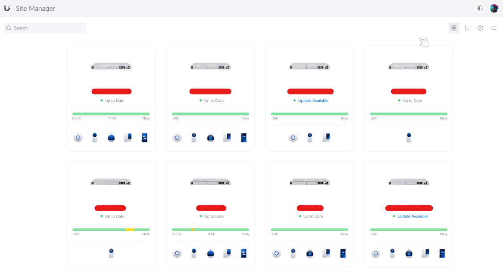
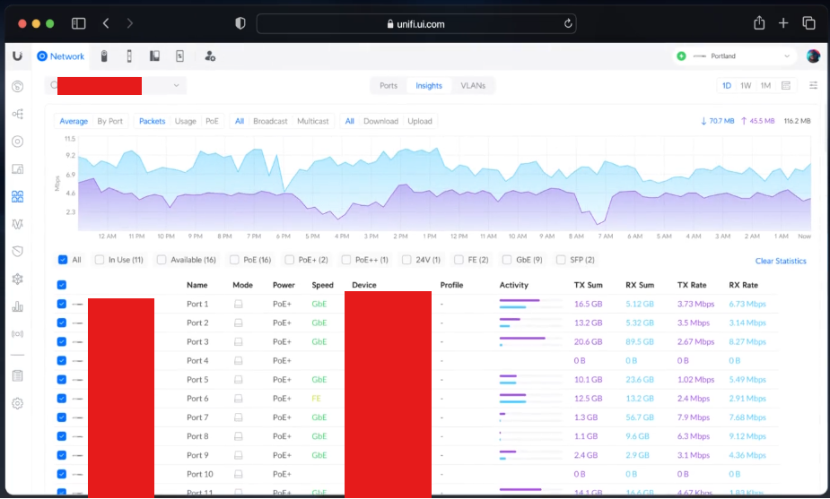
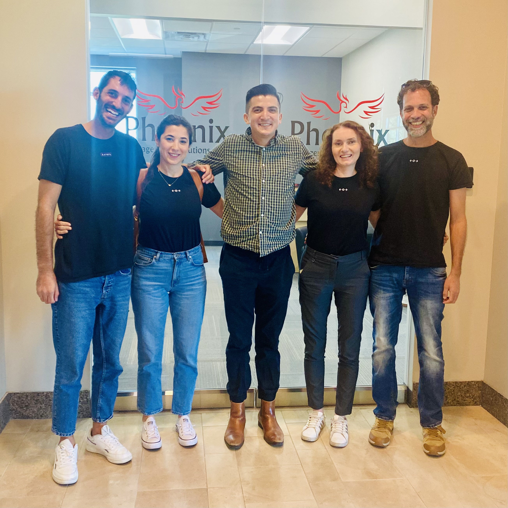

# From Chaos to Digital Transformation: My Journey with Phoenix Management Solutions

## Introduction
When I first joined Phoenix Management Solutions, the environment could only be described as chaotic. The company, a U.S.-based business process outsourcing firm supporting eight different trucking companies with 25 offices across the nation, was grappling with the immense challenge of scaling its IT infrastructure to meet the demands of rapid growth. The need for streamlined operations and robust systems was urgent, but the path to achieving this was fraught with obstacles. Fast forward to today, and the landscape has transformed dramatically. Our focus has shifted from merely keeping the lights on to driving digital transformation and optimization, positioning Phoenix Management Solutions at the forefront of innovation in the SMB logistics and transportation industry.

## The Early Days: Navigating Chaos
When I began my journey with Phoenix Management Solutions as an IT Technician in November 2022, the situation was far from ideal. The company was in the midst of rapid expansion, and the IT infrastructure was struggling to keep pace. Our systems were a patchwork of legacy solutions, each with its own set of inefficiencies. The pressure was immense, with frequent system downtimes, slow response times, and a lack of cohesive documentation making day-to-day operations a challenge. My role involved providing technical and operational support to a business process outsourcing company that oversees seven different trucking companies, each with their own unique regions, requirements, and challenges.

The first order of business was to bring some semblance of order to this chaos. I focused on implementing remote control, ticketing, and cybersecurity tools, including patching, backups, anti-virus, email security, multi-factor authentication, identity access management, firewall, and networking systems. This foundational work laid the groundwork for what would become a comprehensive overhaul of our IT infrastructure.

## System Overhaul and Optimization
In September 2023, I was promoted to the role of Systems Administrator, where my responsibilities expanded significantly. The chaos of the early days began to subside as we implemented more structured processes and systems. I designed, set up, and optimized IT infrastructure across the board, focusing on areas like networking, cybersecurity, PC maintenance, remote management, and cloud integration.

One of the most impactful projects during this time was the networking optimization project aimed at identifying and resolving bandwidth bottlenecks, starting with our headquarters. By accurately assessing which network equipment needed upgrading by understanding the expected computing power from the internal components (such as CPU, RAM, and SSDs), we were able to significantly increase internet bandwidth by 400% — with our internet speed at headquarters improving from an average of 200 Mbps to 800 Mbps on average.

This project has since expanded to include onboarding all of our sites across the U.S. into the same Ubiquiti network for enhanced visibility and control. Additionally, we implemented internet backups at larger sites to ensure 99.99% uptime, providing a robust and reliable network infrastructure across our operations.

Collaboration was key to our success during this phase. I worked closely with HQ, Terminal Managers, and the Field Operations Teams to get their requirements and needs in order to plan, design, and implement network installations/upgrades. This included everything from installing new Wi-Fi systems and wireless internet backups to maintaining comprehensive documentation of processes and procedures. The result was a more resilient and efficient IT infrastructure capable of supporting our rapidly growing operations.

In April 2024, I took on the role of Network and Systems Administrator, a position that allowed me to drive even more significant changes. With the foundational systems in place, our focus shifted from simply managing day-to-day operations to driving digital transformation and optimization.

Today, we are leveraging advanced technologies like generative AI and automation to enhance our operations further. Our goal is not just to keep up with the industry's demands but to set new standards in customer service, efficiency, and innovation. The systems we have built are not just robust; they are agile, capable of adapting to the ever-changing needs of our business and the industry at large.

[Customer Success Story - Phoenix Management Solutions & Atera](https://www.atera.com/customer-stories/phoenix-management-solutions/)

## Conclusion
Looking back, the journey from chaos to digital transformation at Phoenix Management Solutions has been both challenging and rewarding. The work we have done has not only stabilized our IT infrastructure but has also positioned us as a leader in the logistics and transportation industry. I am proud of the role I have played in this transformation and excited about the future as we continue to push the boundaries of what is possible through technology and innovation.

# [Mark's Project Portfolio](https://markandrewmarquez.com/portfolio/)
